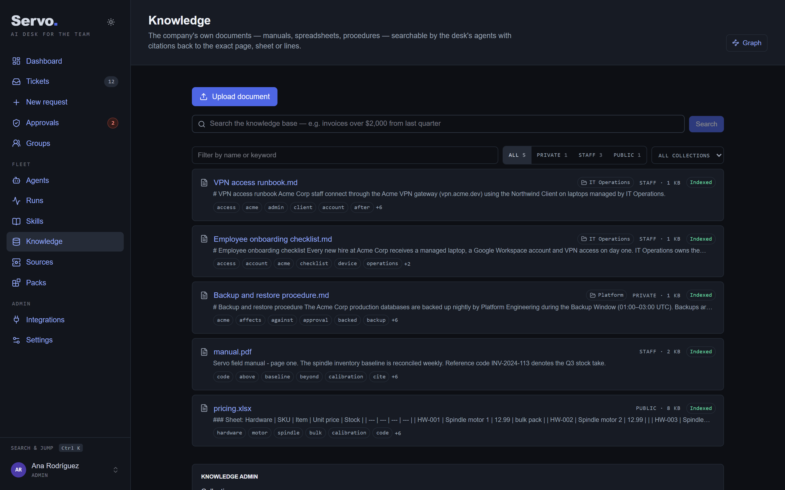
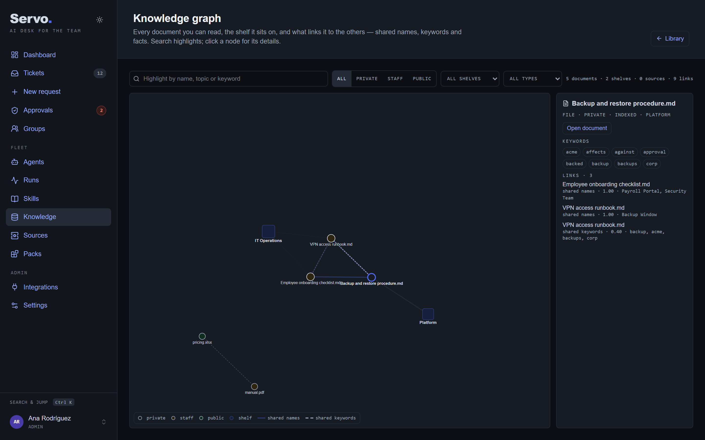
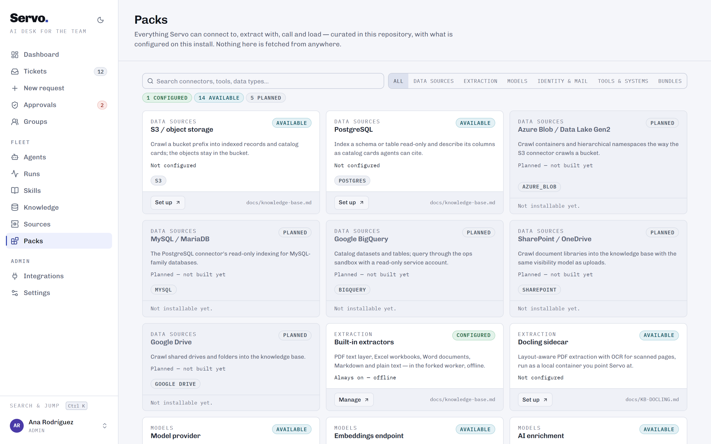
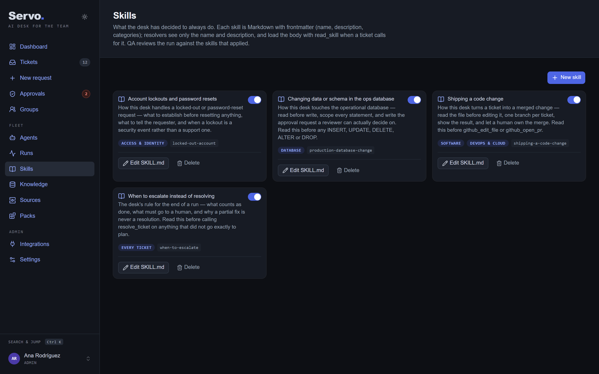
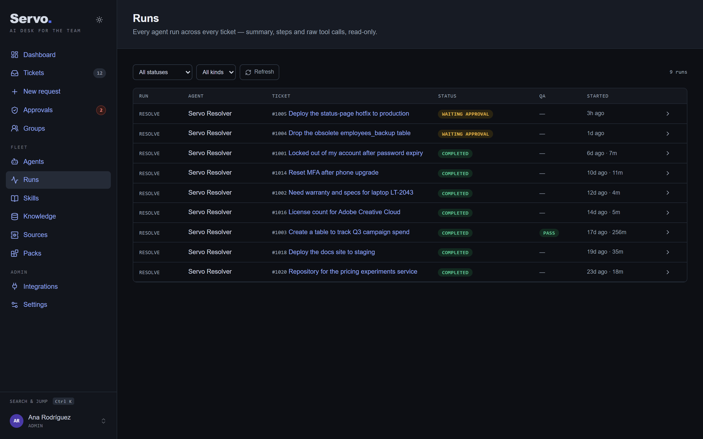

<p align="center">
  
</p>

# Servo

[](https://github.com/ricauts/servo/actions/workflows/ci.yml)
[](LICENSE)

**The open-source AI desk for the whole team — agents, skills, knowledge and human approvals in one queue, where a resolved ticket can become a skill and a document a cited answer.**

Requests arrive by email, from the web or through the API. AI agents triage them, draft every reply and work them with real tools — SQL, device inventory, GitHub, Azure, your own HTTP integrations — and **pause for a named human** before anything the desk has gated. Agents read the procedures your team wrote as skills and the documents you uploaded to the knowledge base, cite what they used, and a QA pass reviews what they did. Everything lands on one dashboard, including how many AI replies shipped untouched.

<p align="center">
  
</p>

Runs self-hosted on PostgreSQL with one `docker compose up`. Bring your own model — Anthropic, Z.AI GLM, any OpenAI-compatible endpoint — or evaluate entirely offline on the built-in deterministic mock provider. Sign in through any OIDC identity provider; secrets are encrypted at rest with a key the container generates for you.

## What the desk does

**Works the queue with agents.** Assign any ticket to a person or to the AI resolver. Triage categorizes, prioritizes and routes; the resolver plans, calls tools, and persists every step so a ticket reads like a conversation you can unfold to the raw trace. Specialized agents (Developer, Analytics, Cybersecurity, or yours) are Markdown personas with their own tool allowlist and their own API key.

**Keeps humans in charge.** Every tool carries a risk level and an editable *requires approval* policy. A gated call pauses the run, lands in the Approvals inbox next to the AI reply drafts waiting for review, and resumes from persisted state once someone decides. HIGH-risk decisions are admin-only; a rejection flows back to the agent, which adapts instead of retrying. After runs that touched medium- or high-risk tools, a QA agent reviews the transcript and reassigns failures to a human.

**Follows the procedures you wrote.** Desk skills are `SKILL.md` documents — how a lockout is handled, what to check before a database change, when to escalate. The resolver sees a catalogue and loads a body on demand, QA is told which skills applied and which the run actually opened, and an admin can turn a resolved ticket into a new skill from its timeline.

**Answers from your documents, with citations.** Upload PDFs, Excel workbooks, Word documents, Markdown and text; connect an S3 bucket or a PostgreSQL database. Extraction runs offline in a sandboxed worker, retrieval is filtered by entitlement *inside the database query*, and every answer names the page, sheet or lines it came from. Agents read only what someone explicitly shared with them.

**Organizes that knowledge like a library.** Keywords per document, filters by shelf and visibility, an interactive graph of documents, shelves and data sources, and — opt-in — AI enrichment that writes topics and a summary in the document's own language and files it on a shelf.

**Remembers.** Before acting, the resolver searches the tickets this desk already closed and the resolutions people recorded, with other requesters' identities withheld.

**Plugs into what you run.** SSO, SMTP in and out, GitHub, Azure, MCP servers (every imported tool quarantined until an admin enables it), custom HTTP tools, signed webhooks, local plugin bundles — and **Packs**, the catalog that shows what is connected and what is available.

## A ticket, end to end

A requester asks for a production hotfix. Triage prioritizes it and hands it to the resolver; the resolver reads the desk's deployment skill, inspects the repository, and reaches `cloud_apply_deployment` — a gated tool — so the run pauses and an approval lands in the inbox with the exact input a human will sign off. The run folds into one line on the ticket — agent, outcome, the tools it used and who approved what — and unfolds to the full step-by-step trace. Nothing risky happens without a named person deciding it.

| The ticket, with the run folded into its story | Approvals — tool sign-offs and reply drafts, one queue |
|---|---|
|  |  |

## Screenshots

| Knowledge — the library with filters, shelves and keywords | The knowledge graph — documents, shelves, sources |
|---|---|
|  |  |

| Packs — connectors, models and bundles, with the install's state | Agents — personas, their tools, keys and throughput |
|---|---|
|  |  |

| Skills — the procedures the desk follows | Runs — every agent run, its steps and tool calls |
|---|---|
|  |  |

| Ticket queue | Integrations — SSO, mail, GitHub, MCP |
|---|---|
|  |  |

| Settings — model provider, key pool, tool policies |
|---|
|  |

<p align="center">
  <br/>
  <em>Fully responsive — the same app on mobile.</em>
</p>

## Quickstart

```bash
docker compose up --build
```

Open [http://localhost:3000](http://localhost:3000). The **first-run wizard** creates your admin account and, optionally, connects your SSO tenant; you start with a clean desk. Set `SERVO_DEMO=1` for a populated showcase instead, and a provider key (or configure one in Settings) for real model calls — without one Servo runs in mock mode.

For a local checkout (`npm install`, `npm run setup`, `npm run dev`), sign-in options, providers, the demo users and the production checklist, read [docs/SETUP.md](docs/SETUP.md). Two seeds ship: `prisma/seed-core.ts` bootstraps a clean install and is idempotent; `prisma/seed-demo.ts` is the showcase dataset and wipes the database first.

## Documentation

- [docs/SETUP.md](docs/SETUP.md) — install, sign-in, bring your own key, the demo dataset, production checklist
- [docs/USER-GUIDE.md](docs/USER-GUIDE.md) — the day-to-day guide: integrations, the reply loop, approvals, agents, skills, troubleshooting
- [docs/knowledge-base.md](docs/knowledge-base.md) — formats, the entitlement invariant, the library, enrichment, the graph
- [docs/packs.md](docs/packs.md) — the catalog of connectors and bundles
- [docs/ARCHITECTURE.md](docs/ARCHITECTURE.md) — the engine, tools, policies, the ops sandbox, the project tree
- [docs/README.md](docs/README.md) — the full index, including [connectors](docs/connectors.md), [skills](docs/skills.md), [plugins](docs/plugins.md) and the design rationale

## Security

The full model lives in [SECURITY.md](SECURITY.md). The short version: real sign-in through any OIDC provider with a domain allowlist and per-requester data isolation; secrets encrypted at rest with AES-256-GCM; gated agent actions that wait for a named human; read-only SQL inside a read-only transaction against a separate sandbox database; an egress guard that refuses private and link-local addresses on every outbound request and re-checks every redirect. Honest residuals: custom HTTP tools reach whatever an admin points them at, and there is no built-in rate limiting yet — front a public install with a proxy.

## Roadmap and contributing

[ROADMAP.md](ROADMAP.md) lists what shipped, what is in progress and what is next. Servo grows one real, tested integration at a time — nothing lands as a mock of itself. Have an opinion on priorities? Open an issue.

## License

[Apache-2.0](LICENSE) — Copyright 2026 Servo contributors. Third-party code and its licences are recorded in [THIRD_PARTY.md](THIRD_PARTY.md).
