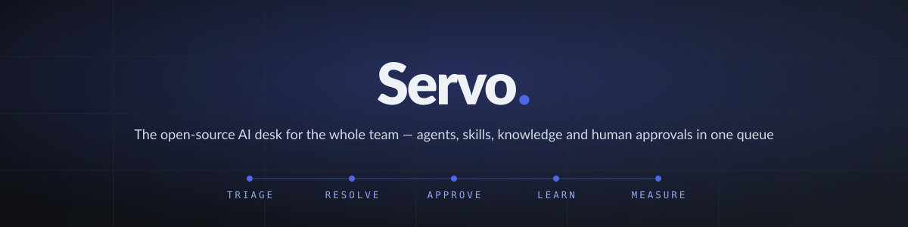
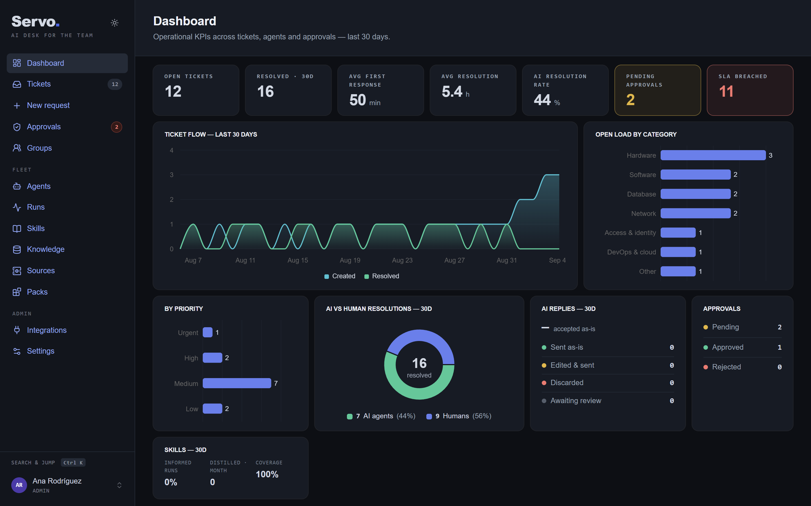
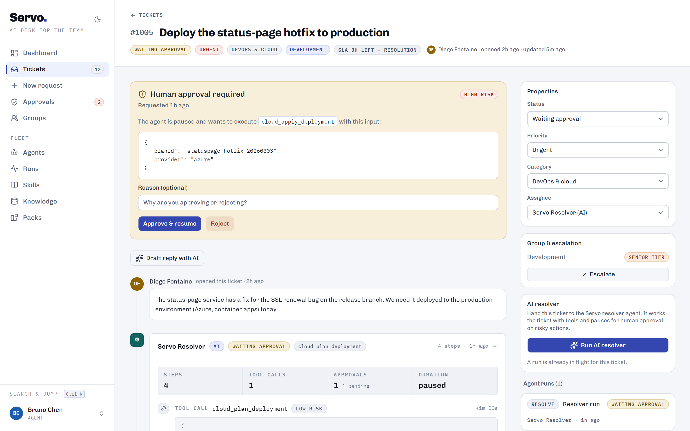
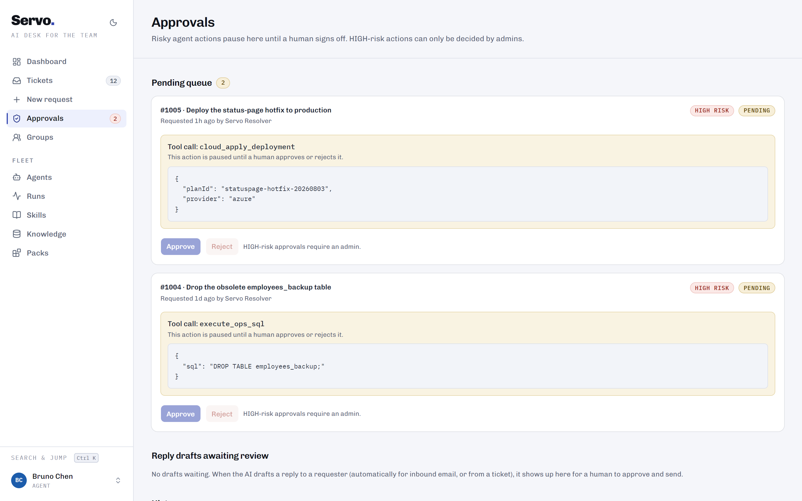
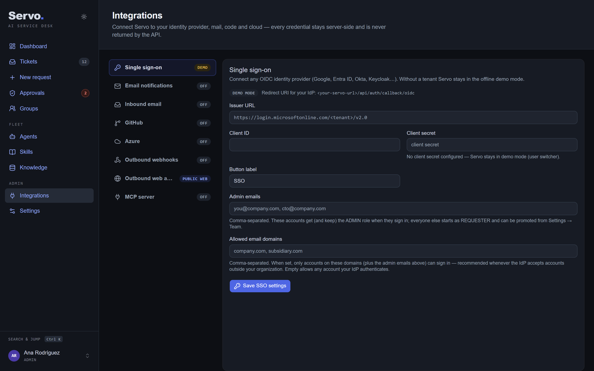
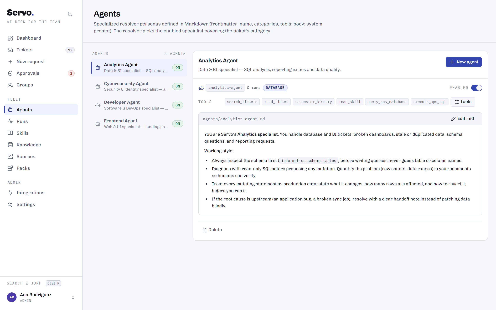
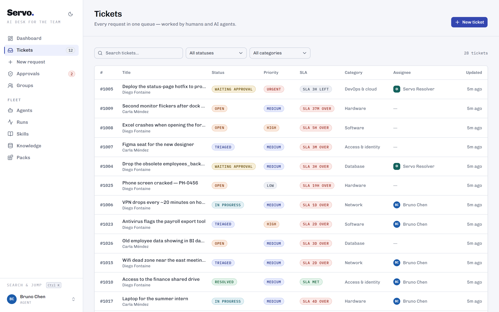
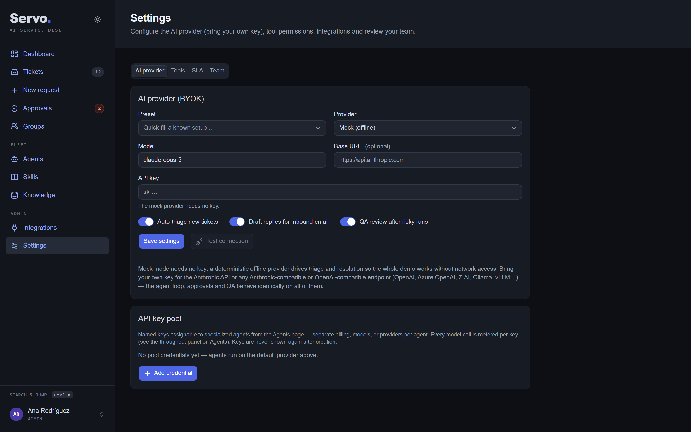
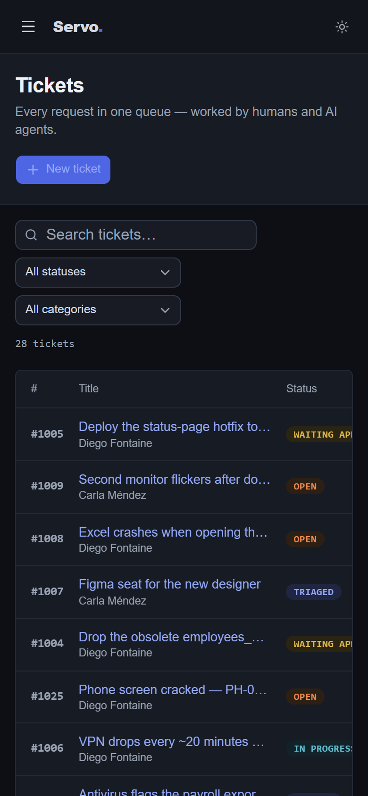

<p align="center">
  
</p>

# Servo

[](https://github.com/ricauts/servo/actions/workflows/ci.yml)

**An open-source, self-hostable AI-powered service desk.** Email becomes tickets; AI agents triage them, draft every reply and work requests with real tools (SQL, device inventory, **real GitHub repos/branches/PRs, live Azure queries**), pause for **human approval** before anything risky, get an automated **QA review** afterwards — and everything feeds a **KPI dashboard**, including how many AI replies ship untouched. Humans and AI agents work one queue — and every resolved ticket can become a skill your AI runs next time.

<p align="center">
  
</p>

Bring your own model — Anthropic, Z.AI GLM, or any OpenAI-compatible endpoint — or evaluate entirely offline with the built-in deterministic mock provider. Self-host it with real SSO (any OIDC IdP — `src/lib/authjs.ts`), per-requester data isolation, secrets encrypted at rest, and a first-run wizard that takes a clean install to a working desk in one screen.

> **Status: production-ready for self-hosting.** Fresh installs start clean (no demo data), sign in through your identity provider, and store secrets encrypted. Follow the [production checklist](#production-checklist) and read [SECURITY.md](SECURITY.md) before exposing an install to real users.

## Features

- **Tickets for humans and AI** — assign any ticket to a human agent or to the AI resolver; the resolver works the ticket end to end.
- **Automatic triage** — new tickets are categorized, prioritized, and routed by an AI triage agent (toggleable in Settings).
- **Tool-using resolver** — the AI resolver operates a registry of built-in tools plus any custom ones you define: read-only and mutating SQL against a sandboxed ops database, device inventory lookups, password resets, GitHub read/commit/PR/merge operations, page screenshots, Azure resource listing, and cloud deployment plan/apply.
- **Readable audit trail** — a run is one entry in the ticket story: who acted, the outcome, the tools it used and who approved what. Unfold it and every step is there verbatim — folded by default so a ticket reads like a conversation, never truncated.
- **Human-approval gates** — each tool carries a risk level (LOW/MEDIUM/HIGH) and an editable *requires approval* policy. When the agent reaches a gated tool, the run pauses, an approval lands in the Approvals inbox, and the run resumes exactly where it left off after a decision. Rejections flow back to the agent, which adapts instead of retrying.
- **Automated QA review** — after a run that executed medium/high-risk tools, a QA agent reviews the transcript and issues a PASS/FAIL verdict; failures reassign the ticket to a human with an explanatory comment.
- **KPI dashboard** — open tickets, resolution times, first-response times, AI-vs-human resolution split, approval stats, ticket volume over 30 days, and **AI reply acceptance** (sent as-is vs edited vs discarded) so you can see exactly how much typing the AI is saving.
- **BYOK with offline mock mode** — plug in an Anthropic API key via Settings or environment variable, or run fully offline with the deterministic mock provider.
- **API key pool with per-agent assignment and throughput metering** — register multiple named credentials (any provider mix), assign one per specialized agent from the Agents page, and every model call is logged (tokens in/out, latency, key, agent). A throughput panel on Agents aggregates the last 7 days per key and agent.
- **SLA targets with automatic escalation** — per-priority response and resolution targets (editable in Settings). Every ticket carries live SLA state on the queue and detail views, the dashboard tracks breaches, and a scan escalates missed targets one tier up the group hierarchy — assigning the least-loaded eligible member and logging why. Schedule `POST /api/sla/scan` to run it unattended.
- **Groups & escalation hierarchy** — assignment groups (Development, Analytics, Engineering…) own ticket categories; members carry JUNIOR → MID → SENIOR tiers per group, or STANDALONE for specialists outside the ladder. Priority sets the minimum tier, and any agent can escalate a ticket up a tier or across to another group — the least-loaded eligible member picks it up and the move is logged on the timeline.
- **Real Azure integration (read-only)** — a service principal with `Reader` is enough: `azure_list_resources` runs live Resource Manager queries (subscription-wide or scoped to a resource group), with a Test-connection button that acquires a token and lists resources. Mutating cloud actions stay simulated behind the approval gate.
- **Ships code, gated by humans** — the GitHub tools go past "open an empty branch": `github_read_file` inspects the real source, **`github_edit_file`** commits a precise find/replace on a feature branch (the approval card shows the exact before/after, and an ambiguous match is refused rather than guessed), `github_open_pr` raises the PR and **`github_merge_pr`** lands it — which triggers whatever deployment workflow the repo already has. Both write steps require human approval.
- **The desk remembers** — before it acts, the resolver searches the tickets *this* desk has already closed: `search_tickets` ranks past tickets by relevance (title, description and the resolution someone actually recorded, preferring tickets that reached an outcome), `read_ticket` opens one in full — replies sent, tools used, resolution — and `requester_history` shows what else this person has filed, so the third replacement dock in two months reads as a hardware fault instead of a new request. Precedent without the privacy leak: another requester's name and email are withheld unless the past ticket is the same person's, so nothing gets quoted back to the wrong requester. No embedding model, no vector store, no configuration — it works on a fresh install and offline.
- **Reads the web, safely** — `fetch_url` opens an http(s) page and hands the agent readable text (HTML flattened to headings, bullets and links), so a resolver can quote the vendor status page or the release notes a requester linked to instead of guessing. Because tickets arrive by email, the URL may be attacker-chosen: every outbound request — this tool, screenshots and custom HTTP integrations alike — resolves the host first and refuses loopback, private, CGNAT and link-local addresses (`169.254.169.254` included), then re-checks each redirect. An optional allowlist in Integrations narrows it to named hosts, and a literal entry there is how you deliberately reach an intranet host.
- **Screenshots for review** — `take_screenshot` renders a page in a real browser on the server and attaches the image to the ticket, so a reviewer *sees* a proposed UI change before approving it. It renders a raw branch file too, which means the "after" image exists before anything is merged. Needs a Chrome/Chromium on the host (`PUPPETEER_EXECUTABLE_PATH`); without one the tool says so instead of pretending.
- **Real GitHub integration** — add a personal access token (env `GITHUB_TOKEN` or Settings, with a Test-token button) and `github_create_repo` / `github_create_branch` / `github_open_pr` hit the real GitHub API — still behind their risk levels and approval gates. A ticket like "implement feature X" becomes a real feature branch (and PR) created by the resolver. Without a token they stay simulated so the offline demo keeps working. A base-URL override supports GitHub Enterprise.
- **Outbound webhooks** — stream `ticket.created/resolved/escalated` and `approval.pending/decided` to any endpoint as signed JSON (`x-servo-signature: sha256=HMAC(secret, body)`). Manage endpoints and subscriptions from Settings, send test pings, and watch a per-endpoint delivery log with latencies.
- **Command palette (Ctrl/⌘ K)** — search tickets by number, title, or text and jump to any page from the keyboard, anywhere in the app.
- **Email in and out** — outbound: ticket received / resolved to the requester and pending approvals to every admin, over any SMTP server (`SMTP_URL` or Settings, with a test-send button); sending is best-effort so a broken mail setup never blocks ticket flows. Inbound: point a provider webhook (SendGrid Inbound Parse, Mailgun, Postmark) at `POST /api/inbound/email` — or, for Gmail / Google Workspace, run the bundled `scripts/imap-relay.mjs` against the mailbox — and mail becomes tickets — unknown senders are created as requesters, and a subject carrying `#1029` files the message as a comment on that ticket instead. Bounces and auto-replies never become tickets: a delivery failure is posted on the ticket of the person it failed to reach ("the requester has not received the last reply"), so a dead address surfaces where it matters instead of as noise — or a mail loop.
- **AI reply drafts with human approval** — the everyday support loop: when an email opens a ticket, the AI drafts the answer (in the requester's language, using the category's specialized agent and its own API key) and a human reviews it — edit in place, approve, or discard. Approving posts it as a public comment and emails it to the requester with a subject that threads their reply back onto the same ticket; the first-response SLA clock starts on send. Pending drafts queue on **Approvals** next to tool sign-offs; a requester follow-up regenerates a stale pending draft with the new context, and closing a ticket auto-discards its draft. Toggle auto-drafting in Settings → AI (`Draft replies for inbound email`), or draft on demand from any ticket.
- **MCP server** — Servo speaks the Model Context Protocol: point any MCP client (Claude Code, Claude Desktop, other agents) at `POST /api/mcp` with a bearer token (Integrations -> MCP server) and it can file, search and read tickets (`create_ticket`, `search_tickets`, `read_ticket`, `requester_history`) and operate the whole tool registry — custom tools included, excluding ticket-bound core tools, policy-disabled tools and anything gated on human approval (no human is in the loop over MCP, so those stay behind a ticket).
- **Custom tools & integrations** — admins define new HTTP tools from Settings (method, URL, headers, body template with `{input.field}` placeholders, and a stored secret injected via `{secret}`). They join the resolver's registry like built-in tools, with the same risk levels and human-approval gates — the fastest path to integrating a webhook, an internal API, or a SaaS endpoint.
- **Specialized agents as `.md` files** — resolver personas (Analytics, Developer, Cybersecurity…) are Markdown documents with YAML frontmatter (`name`, `categories`, `tools`) and a system-prompt body. Drop files into `agents/` or create/edit them from the UI; the resolver automatically uses the enabled specialist covering the ticket's category. A **visual tool picker** per agent (checkboxes with each tool's risk and approval policy) narrows what it may call — no YAML editing — while core tools stay always-on and the .md frontmatter is rewritten to match.
- **Desk skills as `.md` files** — the procedures the desk has agreed to follow (how a lockout is handled, what to check before a database change, when to escalate instead of resolving), versioned as `skills/<slug>/SKILL.md` and editable from the **Skills** page. Progressive disclosure, the way Claude Code loads skills: the resolver's prompt carries only each skill's name and description, and the body costs one `read_skill` call — so a desk can hold dozens of procedures without bloating every prompt. `categories: []` makes a skill desk-wide; a skill never overrides an approval gate; and **QA is told which skills applied and which the run actually read**, so an agreed procedure that gets ignored is caught before the ticket closes. External MCP clients can read them too.
- **Role-based permissions** — ADMIN, AGENT, and REQUESTER roles with an enforced permission matrix (`src/lib/permissions.ts`); HIGH-risk approvals and group management are admin-only.
- **Offline evaluation mode** — without an OIDC tenant Servo runs a demo user switcher, so you can experience every role (and the whole agent loop, on the mock provider) with no auth provider, no API key and no network.
- **shadcn/ui frontend** — Tailwind v4 + [shadcn/ui](https://ui.shadcn.com) components and charts (Recharts), themed with Servo's green-accent OKLCH palette; light mode by default with a dark-mode toggle.
- **Docker-ready** — one `docker compose up --build` gives you a self-contained instance with persistent SQLite volumes.

## A real ticket, end to end

Someone emailed the desk to say a button on our own landing page was unreadable. Servo triaged it, the frontend specialist read the source, diagnosed the CSS, and **captured what it looked like before and after its fix — from the branch, before anything was merged** — so a human could approve on evidence rather than on a diff:

<p align="center">
  
</p>

Both screenshots land on the ticket, next to the AI-drafted reply waiting for review. The run itself folds into one line — agent, outcome, QA verdict, the tools it used and who approved what — and unfolds to the full step-by-step trace:

<p align="center">
  
</p>

The commit and the merge each stopped for a human. Approvals — tool sign-offs and reply drafts — share one queue:

<p align="center">
  
</p>

## Screenshots

| Integrations — SSO, mail, GitHub, MCP connected | Specialized agents, their tools and throughput |
|---|---|
|  |  |

| Ticket queue | Settings — BYOK & tool permissions |
|---|---|
|  |  |

<p align="center">
  <br/>
  <em>Fully responsive — same app on mobile.</em>
</p>

## Quickstart

Requires **Node.js 20+**.

```bash
npm install
npm run setup   # prisma generate + db push + core bootstrap (no sample data)
npm run dev
```

Open [http://localhost:3000](http://localhost:3000) — the **first-run wizard** creates your admin account (and, optionally, connects your SSO tenant). You start with a clean desk: zero tickets, no sample users, nobody else's data. The database is SQLite — no external services needed.

Want a populated playground instead? `npm run demo` loads a fictional showcase dataset (~28 tickets, completed AI runs, pending approvals) so every screen is meaningful instantly. It **wipes the database** — demo evaluation only, never a live install.

Run the unit tests with `npm test`, the RBAC matrix with `node scripts/permissions-audit.mjs`, and the responsive check with `node scripts/responsive-audit.mjs` (both need the dev server running).

### Run with Docker

```bash
docker compose up --build
```

The container bootstraps its SQLite databases on a named volume (`/data`) on first boot, then serves on [http://localhost:3000](http://localhost:3000) — visit it to run the setup wizard. Set `SERVO_DEMO=1` for the showcase dataset instead, and `ANTHROPIC_API_KEY` (or configure a key in Settings) for real model calls; without one Servo runs in mock mode.

### Production checklist

Before exposing an install to real users, set these (see [SECURITY.md](SECURITY.md) for the full model):

- `AUTH_SECRET` — session signing (any long random string).
- `SERVO_ENCRYPTION_KEY` — encrypts stored secrets (API keys, tokens, SMTP URLs) at rest with AES-256-GCM. Existing plaintext rows migrate with `node scripts/encrypt-secrets.cjs`.
- An OIDC tenant (wizard or Integrations → SSO) plus `AUTH_ALLOWED_DOMAINS` — real sign-in, scoped to your org.
- HTTPS in front (reverse proxy) and `APP_URL` set to your public URL.
- Scoped credentials for integrations: a fine-grained GitHub PAT, a Reader-role Azure service principal, an app password for the mailbox.

## Authentication (SSO / OIDC)

Servo ships with real sign-in for self-hosted deployments: connect any OIDC identity provider (Entra ID, Google, Okta, Keycloak, Auth0...) via env vars or from **Integrations -> Single sign-on**. Users are provisioned on first sign-in (REQUESTER by default; `AUTH_ADMIN_EMAILS` keeps admins), roles are managed from **Settings -> Team**, and a **first-run setup wizard** (`/setup`) bootstraps fresh installs: the first admin, the system AI agents, default policies, and (optionally) your SSO tenant. Without OIDC config Servo stays in the offline demo mode with the user switcher. For local development, `node scripts/mock-idp.mjs you@x.com` starts a throwaway IdP.

Hardening and recovery:

- **Allowed email domains** (`AUTH_ALLOWED_DOMAINS` or Integrations -> SSO): when set, only accounts on those domains — plus the explicit admin emails — can sign in. Set it whenever your IdP will authenticate accounts outside your org (e.g. Google with an external consent screen); rejected sign-ins land back on `/login` with a clear message and are never provisioned.
- **Locked out by a bad SSO config?** `node scripts/reset-sso.cjs` clears the OIDC tenant (keeping admin emails/domains) and drops Servo back to demo mode so you can fix it from `/integrations`.

Google Workspace example: create an OAuth client (type *Web application*) in [Google Cloud Console](https://console.cloud.google.com/auth/clients) with redirect URI `<servo-url>/api/auth/callback/oidc`, keep the consent screen **Internal**, then save issuer `https://accounts.google.com` + client ID + secret in Integrations.

Integrations now live on their own page (`/integrations`): SSO, email in/out, GitHub, Azure, and outbound webhooks.

## Bring your own key (BYOK)

Servo ships in **mock mode** by default: a deterministic provider that scripts realistic tool-using conversations from the ticket text, so triage, resolution, approvals, and QA all work with no API key and no network access.

For real model calls Servo speaks **two provider dialects**, configurable in **Settings → AI provider** (with quick-fill presets and a **Test connection** button):

| Provider kind | Works with | Env var | Example |
|---|---|---|---|
| `anthropic` | Anthropic API + Anthropic-compatible endpoints | `ANTHROPIC_API_KEY` | base URL override for any compatible endpoint |
| `zai` | Z.AI GLM models — first-class provider | `ZAI_API_KEY` | model `glm-5.2`; endpoint preconfigured, no base URL needed |
| `openai` | Any OpenAI-compatible Chat Completions endpoint | `OPENAI_API_KEY` | OpenAI (`gpt-5.1`), Azure OpenAI (`https://<resource>.openai.azure.com/openai/v1`), vLLM, **Ollama keyless** (`http://localhost:11434/v1`) |

Notes:

- The env var for the selected provider always takes precedence over a key stored in Settings.
- `openai` endpoints with a **base URL but no key** are allowed — that is how keyless local servers like Ollama work.
- If the selected provider has no usable credentials, Servo falls back to mock mode (Settings shows a warning) so the app never breaks.
- The agent loop, approval gates, and QA are provider-agnostic: tool use is translated to Anthropic `tool_use` blocks or OpenAI function `tool_calls` automatically.

> **Secrets at rest:** with `SERVO_ENCRYPTION_KEY` set, every key saved through Settings (and pool credentials, custom-tool secrets, webhook secrets) is encrypted with AES-256-GCM before it touches SQLite. Without the key Servo still works but stores them in plain text — fine for a local demo, not for production. See [SECURITY.md](SECURITY.md).

## Demo users

The seed creates these users, switchable from the user switcher in the sidebar:

| User | Role | What they can do |
|---|---|---|
| Ana Rodríguez | ADMIN | Everything, including Settings, groups, and HIGH-risk approvals |
| Bruno Chen | AGENT | Work tickets, run the AI, decide LOW/MEDIUM-risk approvals; SENIOR in Engineering |
| Elena Duarte, Farid Khan, Gabriela Torres, Hiro Tanaka | AGENT | Group members across Development / Analytics / Engineering at junior→senior tiers |
| Iris Volkov | AGENT | STANDALONE security specialist in Engineering (outside the tier ladder) |
| Carla Méndez | REQUESTER | Create tickets, comment |
| Diego Fontaine | REQUESTER | Create tickets, comment |
| Servo Triage / Resolver / QA | AI_AGENT | The three AI agents (not switchable personas — they act via runs) |

## How the agent loop works

1. **Triage** — on ticket creation (when auto-triage is on), the triage agent reads the ticket and returns a category, priority, and an AI-or-human routing decision with a rationale posted as a system comment. Tickets that map to available tools are assigned to the AI resolver.
2. **Resolve with tools** — the resolver runs a conversation loop (max 12 iterations): the model plans, calls tools, receives results, and continues. Every text turn, tool call, and tool result is persisted as a run step you can inspect on the ticket timeline.
3. **Approval pause** — when a tool policy says *requires approval*, the run stops, its full conversation is persisted, and an approval request appears in the Approvals inbox and on the ticket. On approval the tool executes and the loop continues from the exact same conversation state; on rejection the agent receives the rejection as an error result and wraps up gracefully.
4. **QA** — if the run executed medium/high-risk tools and QA is enabled, a reviewer agent audits the transcript. A FAIL verdict reassigns the ticket to a human agent with a system comment.

## The knowledge loop

The desk gets smarter with every ticket it closes:

1. **Tickets are the capture loop.** Mail, web, or API — every request lands in one queue (`src/app/tickets/`, `POST /api/inbound/email`, `POST /api/mcp`).
2. **Agents work them under the gate.** Every tool carries a risk level and an approval flag; anything gated pauses the run for a named human and resumes from persisted state once they decide (`src/lib/ai/engine.ts`).
3. **Procedures become skills.** The desk's agreed procedures live as versioned `SKILL.md` files the AI reads before it acts (`skills/`, `src/lib/skill-format.ts`) — and QA is told which skills applied and which the run actually read, so an agreed procedure being ignored is caught before the ticket closes.
4. **Everything is audited.** Engine runs persist every step (`AgentRun` / `AgentStep` in `prisma/schema.prisma`), and every MCP tool call — executed or refused — is policy-checked at the execute site and recorded (`src/lib/mcp.ts`).

*Roadmap:* distilling a resolved ticket into a draft skill automatically (today an admin writes the skill from the ticket timeline), and a company knowledge base with cited answers.

See [ROADMAP.md](ROADMAP.md) for what's shipped, in progress (document upload + RAG knowledge base for agents, WhatsApp/Telegram intake, Postgres/MySQL connectors) and next. [docs/USER-GUIDE.md](docs/USER-GUIDE.md) has the day-to-day usage guide (setup, integrations, the AI reply loop, approvals, troubleshooting), [docs/ARCHITECTURE.md](docs/ARCHITECTURE.md) for the full engine design, [docs/DEMO.md](docs/DEMO.md) for a 5-minute guided tour, and [docs/DESIGN.md](docs/DESIGN.md) for the color system (WCAG-audited light/dark tokens).

## Project structure

```
agents/
  *.md                 # specialized resolver agents (frontmatter + system prompt)
skills/
  <slug>/SKILL.md      # the procedures the AI reads before it acts
prisma/
  schema.prisma        # data model (SQLite; enum-likes are strings)
  seed-core.ts         # fresh-install bootstrap: AI users, default tool + SLA
                       #   policies, agent profiles, skills, ops schema.
                       #   No human users, no sample data. Idempotent.
  seed-demo.ts         # optional showcase dataset (`npm run demo`): demo users,
                       #   tickets, runs, approvals, sandbox ops DB. Wipes first.
src/
  app/                 # Next.js App Router pages + API routes
    api/               # tickets, runs, approvals, settings, kpis, users
    tickets/           # ticket list, new ticket, ticket detail
    dashboard/         # KPI dashboard
    approvals/         # approvals inbox
    groups/            # assignment groups + escalation tiers
    agents/            # specialized .md agent profiles
    settings/          # BYOK + tool policies (admin only)
  lib/
    ai/                # provider abstraction, mock provider, prompts, engine, credential pool
    ai/tools/          # built-in tool registry, one module per domain
    db.ts / opsdb.ts   # app DB and sandboxed ops DB clients
    auth.ts            # cookie-based demo auth
    permissions.ts     # role/action matrix + approval risk rules
    escalation*.ts     # group routing + seniority tier rules
    types.ts           # shared unions and payload shapes (source of truth)
  components/          # UI primitives, shell, and feature components
tests/
  *.test.ts            # the vitest suite (`npm test`), offline on the mock provider
  fixtures/            # test corpora and pinned baselines
scripts/
  *.mjs / *.cjs        # repo guards and lints, operator utilities
  *.ts / *.sh          # the container entrypoint and the tsx-run relay
.github/
  workflows/ci.yml     # typecheck, tests, the repo lints and a production build,
                       #   on every push and PR to main
servo_design_system/
  readme.md            # design source of truth; SKILL.md is the entry point to it
  tokens/*.css         # the semantic colour, type, spacing and motion tokens
  guidelines/*.card.html
docs/
  ARCHITECTURE.md      # stack, data model, engine flow, tool policies
  DEMO.md              # 5-minute guided demo script
  design/*.md          # per-area design rationale behind the work order
```

`servo_design_system/` is **design truth to read before UI work, not application
code the build compiles.** Read its `SKILL.md`, then `readme.md` and the
guideline cards for the area, before changing the interface. The build's only
tie to that directory is the eight `tokens/*.css` files `src/app/globals.css`
imports; no component, kit or document in it is imported by application code.

## Roadmap

- Real AWS and GCP integrations, and Azure write operations (GitHub and read-only Azure already work with credentials)
- A company knowledge base: upload manuals and spreadsheets, retrieval with citations for agents (Postgres on pgvector)
- WhatsApp / Telegram intake channels, and Slack notifications (email in and out already ships — `src/lib/inbound-email.ts`, `src/lib/notify.ts`)
- Skill, agent and plugin bundles as drop-in packages, and per-user MCP tokens

## Security

The full model lives in [SECURITY.md](SECURITY.md). The short version:

- **Real sign-in** via any OIDC IdP, with a server-side domain allowlist; requesters only ever see their own tickets. Demo mode (the user switcher) exists for offline evaluation only — never expose it to a network you don't trust.
- **Secrets are encrypted at rest** (AES-256-GCM via `SERVO_ENCRYPTION_KEY`) and never returned by any API.
- **Risky agent actions sit behind human-approval gates**, read-only SQL is enforced at the driver, and unmet objectives escalate to a human instead of being marked resolved.
- Honest residuals: custom HTTP tools are SSRF-by-design for admins (restrict who is an admin; the egress allowlist ships in Integrations — `src/lib/egress.ts`), and there is no built-in rate limiting yet — front a public install with a proxy/WAF.

## License

[MIT](LICENSE) — Copyright (c) 2026 Servo contributors.
