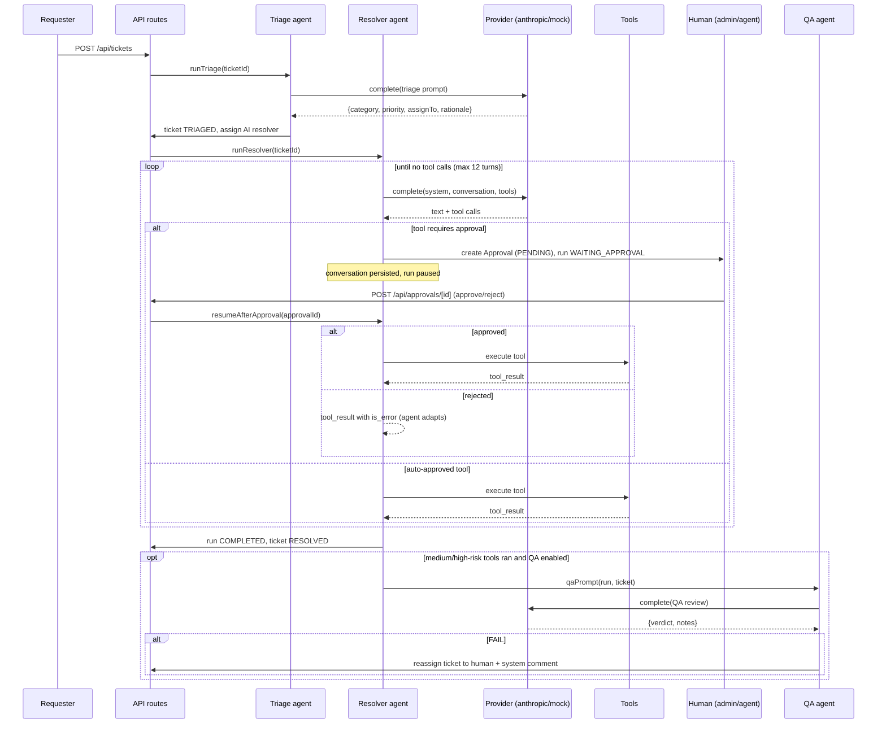

# Servo Architecture

This document describes how Servo is built: the stack, the data model, the AI
agent engine, the tool/approval policy system, and the provider abstraction.
For the build contract that module authors follow, see
[the superseded build contract](history/CONTRACT.md) — kept for provenance under `docs/history/`.

## Stack

| Layer | Choice |
|---|---|
| Framework | Next.js 15 (App Router), React 19, server components by default |
| Language | TypeScript (strict) |
| Database | Prisma 6 + PostgreSQL (pgvector image; app DB `servo`, numbered migrations in `prisma/migrations/`) |
| Styling | Tailwind 4 via `@tailwindcss/postcss` with design tokens (no `tailwind.config.ts`, no raw hex in markup) |
| Validation | zod v4 |
| AI SDK | `@anthropic-ai/sdk` (only used when a key is configured) |

Pages are server-rendered; interactivity lives in small client islands that
call the JSON API routes under `src/app/api/*` and refresh via
`router.refresh()`.

## Data model

Enum-like columns are strings by choice, not by dialect — a Prisma enum would
turn every new status or role into a migration. The union types in
`src/lib/types.ts` are the single source of truth for
values like `TicketStatus`, `Priority`, `RiskLevel`, and `RunStatus`.

- **User** — humans (`ADMIN` / `AGENT` / `REQUESTER`) and AI agents
  (`AI_AGENT` with `aiKind` = `TRIAGE` / `RESOLVER` / `QA`). AI agents are
  ordinary users: they can be assignees and comment authors.
- **Ticket** — number, title, description, status
  (`OPEN → TRIAGED → IN_PROGRESS → WAITING_APPROVAL → RESOLVED → CLOSED`),
  priority, category, requester, optional assignee, plus `firstResponseAt`
  and `resolvedAt` timestamps that feed the KPIs.
- **Group** / **GroupMember** — assignment groups (e.g. Development,
  Analytics, Engineering). A group owns a set of ticket categories
  (`categories` JSON) that triage routes to it; each membership carries a
  per-group `seniority` (`JUNIOR` / `MID` / `SENIOR`). Tickets store the
  owning `groupId` and their current `escalationLevel`. Priority sets the
  minimum tier (`LOW`/`MEDIUM` → JUNIOR, `HIGH` → MID, `URGENT` → SENIOR —
  see `src/lib/escalation-rules.ts`), and `POST
  /api/tickets/[id]/escalate` raises the tier within the group or hands the
  ticket to another group, reassigning to the least-loaded eligible member
  and logging a `SYSTEM` comment.
- **Comment** — `COMMENT` (a person or agent speaking) or `SYSTEM`
  (triage rationale, QA flags, escalation notices, rejection notices).
- **AgentRun** — one execution of an agent on a ticket (`TRIAGE` or
  `RESOLVE`). Holds status, a summary, an optional error, QA verdict/notes,
  and crucially the full provider **conversation as JSON** — that persisted
  conversation is what makes pausing and resuming possible.
- **AgentStep** — the ordered, human-readable trace of a run: `TEXT`,
  `TOOL_CALL`, `TOOL_RESULT`, `APPROVAL_REQUEST`, `QA_REVIEW`, `ERROR`.
  Rendered on the ticket timeline.
- **Approval** — a pending/decided human decision on one tool call. Stores
  the tool name, its JSON input, the provider `toolUseId` (echoed back into
  the conversation on resume), risk level, decider, and reason.
- **AgentProfile** — a specialized resolver persona stored as a Markdown
  document (YAML frontmatter: `name`, `description`, `categories`, `tools`;
  body = system prompt). Seeded from `agents/*.md`, editable from `/agents`
  in the same format. `runResolver` pins the enabled profile covering the
  ticket's category onto the run (`AgentRun.profileId`) so resumes keep the
  same persona; the profile narrows the tool set (core `post_comment` /
  `resolve_ticket` always allowed) and appends its specialization to the
  resolver system prompt.
- **Skill** — a procedure the desk has agreed to follow, stored as a Markdown
  document (YAML frontmatter: `name`, `description`, `categories`; body = the
  procedure). Seeded from `skills/<slug>/SKILL.md`, editable from `/skills` in
  the same format. Progressive disclosure: `buildLoopContext` puts only the
  catalogue (slug, scope, description) of the enabled skills into the resolver
  system prompt — and only when the agent's allowlist kept `read_skill` — while
  the body is loaded on demand by that tool. `runQaReview` tells QA which
  applicable skills the run actually opened. The slug is immutable: it is the
  handle `read_skill` takes and the key `syncSkills()` matches the bundled file
  on.
- **ToolPolicy** — per-tool risk level, enabled flag, and
  `requiresApproval` flag. Editable at runtime from Settings. Applies to
  built-in and custom tools alike.
- **CustomTool** — an admin-defined HTTP integration exposed to the
  resolver as a tool: method, URL, headers, body template and a stored
  secret (never returned by the API). `{input.field}` placeholders are
  substituted from the model's tool input (URL-encoded in the URL) and
  `{secret}` injects the secret. `getToolRegistry()`
  (`src/lib/ai/custom-tools.ts`) merges these with the built-in `TOOLS`
  registry when a loop context is built, so policies, approval gates and
  agent-profile allowlists treat them identically to built-ins.
- **Setting** — key/value store for provider config
  (`ai.provider`, `ai.apiKey`, `ai.baseUrl`, `ai.model`, `ai.autoTriage`,
  `ai.qaEnabled`).

The **sandbox ops database** is `servo_ops`, its own database on the same
Postgres server, reached through two dedicated login roles (`servo_ops_rw`,
`servo_ops_ro`) whose `CONNECT` on the desk database is revoked
(`scripts/postgres-init.sql`, db-05). It holds what the agent operates on:
`devices`, `employees`, `employees_backup`, `software_licenses`,
`campaign_tracking`. It stands in for the real systems a production deployment
would integrate with.

### What the database guarantees (db-08)

Four platform contracts the knowledge base builds on, proven against the real
engine by `tests/pgvector-platform.test.ts` — cite this block instead of
rediscovering them:

1. **Vector nearest-neighbour.** A `vector(N)` column under an HNSW index
   (`vector_cosine_ops`) returns the true nearest neighbour by `<=>` cosine
   distance. `kbSearch` blends this with keyword rank on the same page.
2. **Full-text matching.** A GIN index over `to_tsvector('simple', …)` is
   matched by `websearch_to_tsquery` — plain words and quoted phrases, and
   nothing the query did not name.
3. **RLS is only a backstop WITH `FORCE`.** `ENABLE ROW LEVEL SECURITY` alone
   does **not** bind the table's owner — and the app connects as the role
   that owns the tables. Only `FORCE ROW LEVEL SECURITY` makes the policy
   apply to the owner too. The entitlement CTE remains the primary gate;
   RLS is the belt under those braces, and it is a belt only when forced.
   (Superusers bypass RLS even with `FORCE` — the smoke test demonstrates
   the owner/force trap through a non-superuser role, which is the
   production shape.)
4. **Entitlement policies fail closed.** A policy keyed on
   `current_setting('app.human_id', true)` returns **zero rows** when the
   setting is absent — never all rows. A missing identity reads as "see
   nothing", which is the only safe default.

## The agent engine

The engine lives in `src/lib/ai/` and exposes three entry points from
`engine.ts`:

- `runTriage(ticketId)` — one provider call; parses a JSON verdict
  (category, priority, AI-or-human routing, rationale), updates the ticket,
  posts a system comment.
- `runResolver(ticketId)` — the tool-use loop described below.
- `resumeAfterApproval(approvalId)` — continues a paused run after a human
  decision.

### Flow

### The resolver loop in detail

1. Load the ticket, AI settings, and the **enabled** tool policies. Build the
   system prompt and the initial user message from the ticket.
2. Set the ticket `IN_PROGRESS` (unless resuming).
3. Loop, at most 12 iterations:
   - Call `provider.complete(...)`; persist any text as a `TEXT` step.
   - For each tool call: if the tool is unknown or disabled, feed back an
     error `tool_result`. If its policy requires approval, create a PENDING
     `Approval`, an `APPROVAL_REQUEST` step, set run and ticket to
     `WAITING_APPROVAL`, persist the conversation, and **return** — the run
     is now paused. Otherwise execute it and persist `TOOL_CALL` /
     `TOOL_RESULT` steps.
   - A turn with no tool calls ends the loop: run `COMPLETED` with the final
     text as summary.
4. The conversation JSON is persisted on every state change, so
   `resumeAfterApproval` can reload it, append the tool result (real output
   when approved, an `is_error` rejection message when rejected), and rejoin
   the exact same loop.
5. Any exception sets the run `FAILED` with an `ERROR` step — a run is never
   left stuck in `RUNNING`.

Rejections are informative, not fatal: the agent receives
`"Rejected by <decider>: <reason>"` as an error tool result and is prompted to
adapt (typically posting an explanatory comment and resolving with a note
that human follow-up is needed) rather than retrying the same call.

## Tool registry and risk/approval policy

The built-in tools live in `src/lib/ai/tools/`, one module per domain, and
their names match the seeded `ToolPolicy` rows in `src/lib/ai/tool-policies.ts`
exactly. Risk levels and approval flags below are the seeded defaults — all
editable in Settings at runtime:

| Tool | What it does | Risk | Requires approval |
|---|---|---|---|
| `search_tickets` | Ranked search over past tickets and their recorded resolutions | LOW | No |
| `read_ticket` | One past ticket in full: request, replies, tools used, resolution | LOW | No |
| `requester_history` | The other tickets a requester has filed, and how each ended | LOW | No |
| `query_ops_database` | Read-only SQL (SELECT/WITH only, single statement) against the sandbox ops DB | LOW | No |
| `execute_ops_sql` | Mutating SQL (CREATE/INSERT/UPDATE/DELETE/DROP) against the sandbox ops DB | HIGH | **Yes** |
| `get_device_info` | Device inventory lookup by asset tag (parameterized query) | LOW | No |
| `reset_password` | Password reset + recovery link (simulated) | MEDIUM | No |
| `github_create_repo` | Create a GitHub repository (simulated) | MEDIUM | No |
| `github_open_pr` | Open a pull request (simulated) | MEDIUM | No |
| `cloud_plan_deployment` | Generate an IaC deployment plan (simulated) | LOW | No |
| `cloud_apply_deployment` | Apply a deployment plan (simulated) | HIGH | **Yes** |
| `post_comment` | Post a public comment on the ticket | LOW | No |
| `resolve_ticket` | Mark the ticket resolved with a note | LOW | No |
| `fetch_url` | Read an http(s) page as text, through the egress guard | LOW | No |

**Outbound requests** (`src/lib/egress.ts`). `fetch_url`, `take_screenshot`
and the admin-defined HTTP integrations do not call `fetch()` directly: a URL
an agent picked may have come from the email that opened the ticket. The guard
allows http(s) only, refuses embedded credentials, resolves the host and
rejects loopback/private/CGNAT/link-local/multicast answers, and re-checks
every redirect hop. `integration.egress.allowlist` (Integrations → Outbound
web access) narrows this to named hosts; a literal entry there also permits a
private address, which is the deliberate way to reach an internal service. A
refusal is returned to the model as a readable tool result, so the run adapts
instead of failing.

Approval decisions are themselves permission-gated
(`src/lib/permissions.ts`): admins can decide anything; agents can decide
LOW and MEDIUM risk but **not HIGH**; requesters cannot decide approvals.

## Provider abstraction

`src/lib/ai/provider.ts` defines a minimal `ChatProvider` interface — one
`complete()` method taking a system prompt, a message history in
Anthropic-Messages shape (`ConversationMessage[]` from `src/lib/types.ts`),
and tool specs, returning text plus zero or more tool calls.

- **AnthropicProvider** wraps `@anthropic-ai/sdk` `messages.create` with the
  configured model, key, and optional base URL (covers the Anthropic API and
  Anthropic-compatible endpoints such as Z.AI).
- **OpenAiCompatibleProvider** speaks the Chat Completions dialect over plain
  `fetch` (OpenAI, Azure OpenAI v1, Z.AI, vLLM, keyless local Ollama…). It
  translates our Anthropic-shaped conversation to chat messages —
  `tool_use` blocks become function `tool_calls`, `tool_result` blocks
  become `role: "tool"` messages — and back, so the engine is
  provider-agnostic.
- **MockProvider** (`mock.ts`) is fully deterministic and offline. It derives
  a plausible tool script from the ticket text via keyword matching
  (password → `reset_password`, asset tags → `get_device_info`,
  SQL/table language → the ops-DB tools, repo/deploy language → the
  GitHub/cloud tools), always finishing with `post_comment` +
  `resolve_ticket`. Because it reads the same conversation format, the whole
  pause/resume/rejection machinery behaves identically with or without a key.

Provider selection (`src/lib/ai/settings.ts`): the `ai.provider` setting picks
`anthropic`, `openai`, or `mock`. The provider-matching env var
(`ANTHROPIC_API_KEY` / `OPENAI_API_KEY`) always beats the key stored in
Settings. A non-mock provider is *usable* with a key, or — for `openai`
only — with just a base URL (keyless local endpoints). When the selected
provider is not usable the engine falls back to mock and Settings shows a
warning. `POST /api/settings/test` fires a real one-shot completion (never
the mock) so admins can verify a configuration before saving it.

## Azure integration (read-only)

`src/lib/integrations/azure.ts` authenticates a service principal
(client-credentials against AAD) and issues **read-only** Resource Manager
GETs for `azure_list_resources` — subscription-wide or scoped to a resource
group. Mutating cloud actions stay simulated on purpose: the HIGH-risk
`cloud_apply_deployment` gate is the pattern being demonstrated, not a real
deploy. `AZURE_*` env vars win over Settings, the client secret is never
returned by the API, and `AZURE_LOGIN_URL` / `AZURE_ARM_URL` can be
overridden (sovereign clouds, tests). `POST /api/settings/test-azure`
acquires a token and lists resources so a config is proven end to end.

## GitHub integration

`src/lib/integrations/github.ts` upgrades `github_create_repo` and
`github_open_pr` from simulations to real REST calls when a token exists
(`GITHUB_TOKEN` env wins over the Settings copy; the token is never
returned by the API). Config includes an optional default owner (org or
user; org 404s fall back to the user namespace) and an API base-URL
override for GitHub Enterprise or testing. `POST /api/settings/test-github`
verifies a token with `GET /user`. Tool errors come back as descriptive
strings so the agent can adapt instead of crashing the run.

## Outbound webhooks

`src/lib/webhooks.ts` streams five events (`ticket.created/resolved/
escalated`, `approval.pending/decided`) to every enabled `Webhook` whose
subscription list matches (`["*"]` = all). Payloads are signed with
HMAC-SHA256 of the raw body (`x-servo-signature: sha256=<hex>`); the secret
is generated server-side and shown exactly once at creation. Deliveries are
fire-and-forget with a 10s timeout — the same best-effort contract as email
— and each attempt lands in a rolling per-endpoint log (`WebhookDelivery`,
last 20) surfaced in Settings, where a test-ping button exercises an
endpoint before enabling it.

## SLA and auto-escalation

`SlaPolicy` holds a response and a resolution target per priority plus an
`escalateOnBreach` switch; `DEFAULT_SLA_POLICIES` (`src/lib/sla-rules.ts`)
seeds them and `ensureSlaPolicies()` backfills on upgrade, mirroring the
tool-policy pattern. Tickets store `responseDueAt` / `resolutionDueAt`,
recomputed from **creation** whenever the priority changes (including by
triage), so re-prioritising re-baselines the clock instead of extending it.

`evaluateSla()` is pure and shared by the server and the badges: the
response clock governs until the first reply, then the resolution clock
takes over; resolved tickets report met or breached. `runSlaScan()`
escalates breached tickets one tier inside their group, reusing
`pickGroupAssignee()` so the least-loaded eligible member picks it up, and
writes a SYSTEM comment. `slaEscalatedAt` makes it idempotent — a ticket
escalates once per breach, and a scheduler can call
`POST /api/sla/scan` as often as it likes (admin session, or the
`SLA_SCAN_SECRET` header for unattended runs).

## Inbound email

`POST /api/inbound/email` (`src/lib/inbound-email.ts`) ingests messages from
a provider webhook — SendGrid Inbound Parse, Mailgun Routes, Postmark, or a
small IMAP relay. It accepts JSON, form-urlencoded and multipart bodies and
maps each provider's field names (`from`/`sender`/`From`,
`text`/`body-plain`/`TextBody`). Auth is a shared secret sent as the
`x-servo-token` header or `?token=` for providers that cannot set headers;
the endpoint 404s while the integration is disabled so it does not
advertise itself.

Routing: a subject carrying `#<number>` appends a comment to that ticket
(unless it is CLOSED, which starts a fresh thread); anything else opens a
ticket and runs triage. Unknown senders are created as `REQUESTER` users,
so an external customer can mail in without an account. Quoted history and
signatures are stripped so a reply stores what the person actually wrote.
Triage failures are swallowed: rejecting the delivery would make the
provider retry and duplicate the ticket.

## Email notifications

`src/lib/notify.ts` sends best-effort SMTP email (nodemailer) on three
events: ticket created (→ requester), ticket resolved (→ requester, from
both the `resolve_ticket` tool and manual status changes), and approval
pending (→ every admin). Config follows the BYOK pattern: `SMTP_URL` env
wins over the URL stored in Settings, the URL is never returned by the API
(it may embed credentials), and every send is wrapped so a broken mail
setup can never break a ticket flow. `POST /api/settings/test-email` sends
a real test message for the Settings UI.

